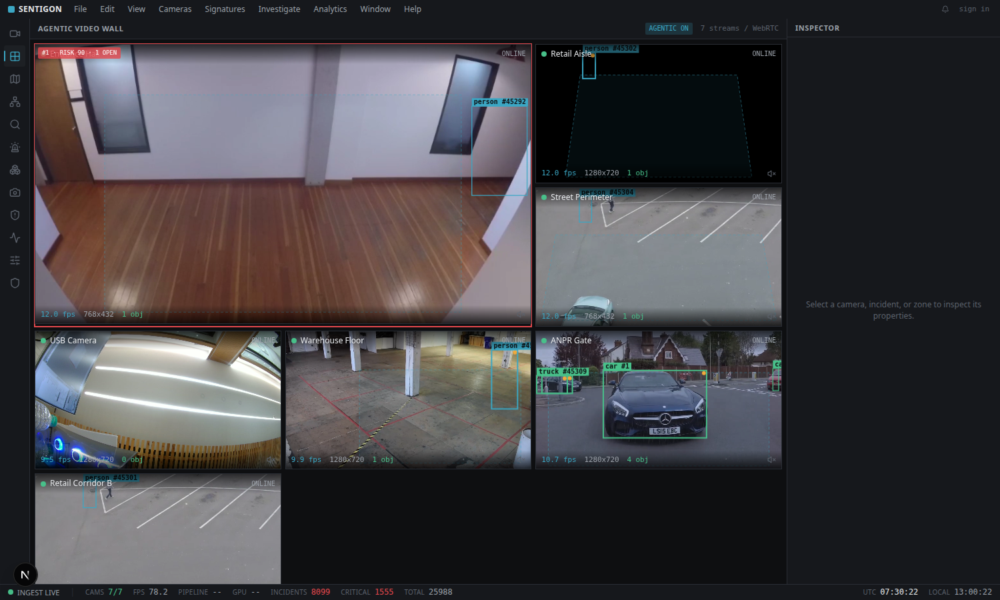
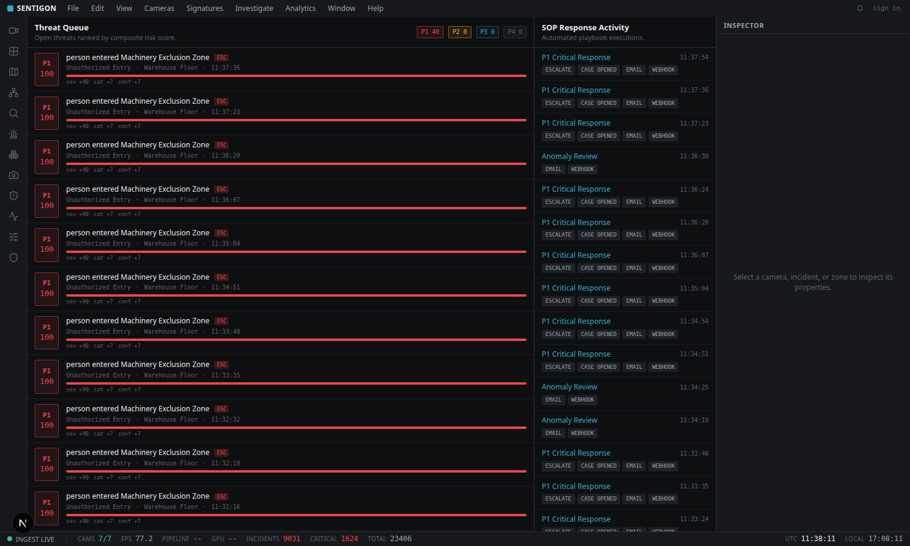
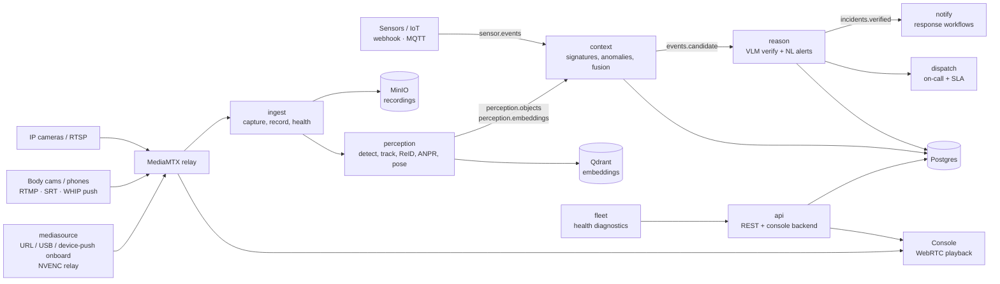
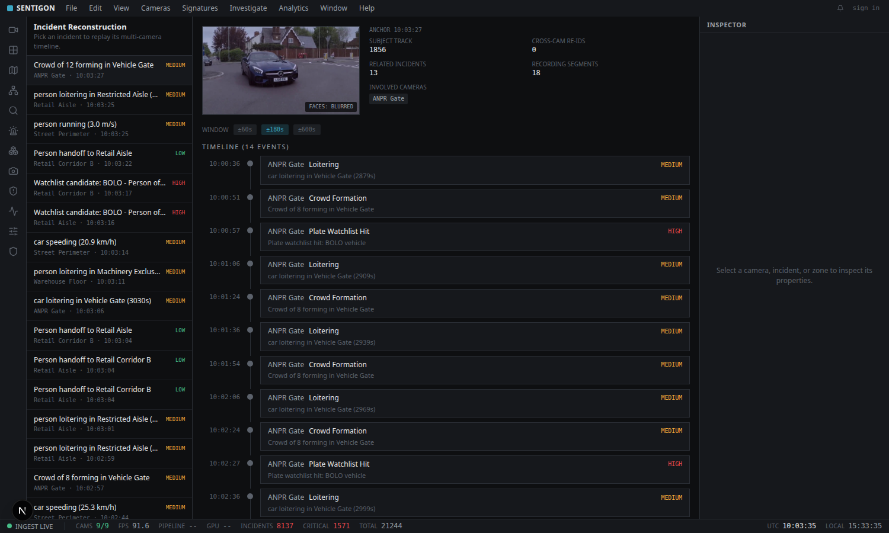

# SentigonEdge
For Edge Devices 


SentigonEdge is a computer-vision security system that runs on a single **NVIDIA Jetson
AGX Orin**. It takes ordinary IP-camera (RTSP) video, detects objects and behaviours,
groups them into scored incidents, asks a local vision-language model to confirm or
dismiss each one, and runs a response workflow — as an event-driven pipeline of small
services, all on-device.

It is a local-first monorepo: the whole stack (inference, database, message bus, object
storage, and the operator console) runs on one Orin. Nothing is required to leave the box.

<p align="center">
  
  <br>
  <em>Live video wall — YOLO detections and tracks drawn client-side from the event bus,
  tiles ordered by current risk.</em>
</p>

## What it does

- **Ingest and recording.** RTSP streams are captured, relayed through MediaMTX for
  browser playback (WebRTC/HLS), recorded in segments to object storage, and kept in a
  short pre-roll ring buffer so evidence exists from *before* an incident fired.
- **Any camera or sensor.** Cameras onboard by URL (RTSP/RTMP/SRT/HLS/MJPEG), by USB
  scan, or by *pushing* to the box (RTMP/SRT/WHIP) — a body cam or phone streamer is
  auto-detected and registered as a camera. A generic **sensor plane** ingests non-camera
  devices (door contacts, PIR motion, environmental, panic buttons, or any generic
  webhook/MQTT feed) as `sensor.events` that fuse with video into incidents.
- **Perception (on the Orin GPU).** Per-camera workers run object detection and
  multi-object tracking (ByteTrack), with optional pose, license-plate reading (ANPR),
  and appearance embeddings for cross-camera re-identification. Detection runs as a
  TensorRT engine built for the Orin.
- **Behaviour signatures.** A stateful context engine evaluates behaviour rules —
  intrusion, loitering, tailgating, crowd formation, running, speeding, zone exclusion —
  plus composite access-plus-video patterns (e.g. a forced door with a person present).
- **Anomaly detection.** Per-zone baselines are learned online; activity that deviates
  from a zone's normal profile is surfaced with a deviation score.
- **Risk scoring and triage.** Each candidate incident gets a composite risk score and a
  P1–P4 priority band. Repeat detections of the same thing roll into one open incident.
- **VLM verification.** High-value candidates are sent with pre/post-roll frames to a
  local vision-language model (Qwen2.5-VL via Ollama) that returns a verdict and a short
  rationale, which re-scores the incident. High-stakes or inconclusive verdicts can
  optionally escalate to a fast external text reasoner (Groq) for a sharper adjudication,
  SITREP, and recommended action — off the streaming hot path; vision stays local.
- **Signal fusion.** Access-control events (badge reads, door-forced, door-held) and
  generic sensor events (contacts, motion, environmental, panic) are correlated with live
  video on a shared timeline and can elevate an ordinary video event into a confirmed
  incident.
- **Response workflows.** Confirmed incidents drive actions: escalate, open a case, send
  email/webhook/web-push, run a timeline investigation, or play a spoken talk-down.
- **Responder dispatch (managed-SOC).** Confirmed high/critical incidents create a
  dispatch, resolve the on-call responder from a rotation, notify them, and track
  acknowledge/resolve SLAs with escalation.
- **Fleet health.** A diagnostics service aggregates per-camera stream health, per-service
  status, and host resources (disk/memory/GPU) into a fleet view with findings.
- **Forensics.** Any incident can be reconstructed into a multi-camera timeline.
- **Natural-language alerts.** Operators can define an alert in plain English and the VLM
  evaluates frames against it on an interval.
- **Privacy controls.** Snapshots can be served with faces blurred, and plate values are
  stored salted-and-hashed rather than in the clear.

<p align="center">
  
  <br>
  <em>Threat queue ranked by composite risk, with the log of automated response runs.</em>
</p>

## Architecture

Services communicate over a Kafka-compatible event bus (Redpanda). No service reaches into
another's database; they publish and consume typed messages on topics.



A shared library, `sentigon_common`, provides the ORM models, message schemas, bus
helpers, object storage, a tamper-evident evidence hash-chain, risk scoring, and logging
used by every service.

### Services

| Service | Responsibility |
|---|---|
| `common` | Shared schemas, ORM, Kafka/MinIO helpers, risk scoring, evidence vault, logging |
| `ingest` | RTSP capture, MediaMTX relay, segmented recording, pre-roll buffer, health, ONVIF/PTZ |
| `perception` | Detection, tracking, ReID embeddings, ANPR, pose (TensorRT on the Orin GPU) |
| `context` | Behaviour signatures, learned anomaly baselines, access/video fusion, dedup |
| `reason` | VLM verification of candidate incidents, natural-language alert evaluation |
| `notify` | Response workflows (escalate, case, email, webhook, web-push, talk-down) |
| `dispatch` | Managed-SOC responder dispatch, on-call rotation, acknowledge/resolve SLAs |
| `fleet` | Camera + service + host health diagnostics |
| `crosssite` | Multi-site provisioning and cross-site entity correlation |
| `search` | Semantic, visual, and ReID forensic search over embeddings |
| `api` | REST API and console backend; threats, analytics, schedules, watchlists, device registry + sensor-event webhook + MQTT bridge |
| `mediasource` | Generic camera onboarding — any RTSP/RTMP/SRT/HLS/MJPEG URL, USB scan, device-push auto-onboard — with an NVENC hardware relay to MediaMTX (libx264 fallback) |
| `governance` | Model evaluation harness and champion-challenger promotion |
| `mcp` | Model Context Protocol surface for incident and search access |

## Built for the Jetson AGX Orin

SentigonEdge is developed and run on a Jetson AGX Orin (64 GB), JetPack 6/7. The
GPU-bound parts are tuned for the Orin:

- **Detection runs as a TensorRT FP16 engine** built on-device for the Orin's GPU
  (`sm_87`). On this hardware a medium YOLO model runs in the tens of milliseconds per
  frame, which keeps several cameras real-time. A CPU fallback exists but is much slower
  and is only intended for bring-up.
- **The vision-language tier runs locally** through [Ollama](https://ollama.com)
  (Qwen2.5-VL), using the Orin's unified memory. It shares the GPU with perception.
- **The media relay uses NVENC** (hardware H.264 encode via GStreamer) for MJPEG USB
  cameras — measured ~80% lower CPU than software `libx264` for a 720p stream. An optional
  **NVDEC hardware-decode** path in perception (`PERCEPTION_HW_DECODE`) offloads video
  decode from the CPU; it earns its keep at many-camera / high-resolution scale.
- Set the board to its full power mode (`sudo nvpmodel -m 0 && sudo jetson_clocks`) for
  best throughput.

The reasoning tier is pluggable through `REASON_ENDPOINT`, `REASON_MODEL`, and
`REASON_BACKEND`: the same service can point at a larger model served elsewhere for batch
verification without touching application code. Separately, an optional escalation tier
(`REASON_SVC_ESCALATE_*`) sends the local VLM's scene description plus context to a fast
external text reasoner (e.g. Groq `gpt-oss-120b`) for a second-opinion verdict on
high-stakes incidents — vision never leaves the box.

## Models

All models run locally and are fetched separately (they are not committed to the repo).

| Task | Model |
|---|---|
| Object detection | Ultralytics YOLO (exported to a TensorRT engine on the Orin) |
| Tracking | ByteTrack |
| Re-identification | OSNet-AIN (MSMT17) or a ResNet-50 fallback |
| License plates | YOLO plate detector + EasyOCR |
| Pose / fall | YOLO pose |
| Vision-language reasoning | Qwen2.5-VL (local, via Ollama) |
| Text-to-speech | Piper |

<p align="center">
  
  <br>
  <em>Incident reconstruction — a subject's activity replayed across cameras with the
  covering recording segments and related incidents.</em>
</p>

## Development without camera hardware

You do not need physical cameras. Sample surveillance-style video files are restreamed
through MediaMTX as live RTSP feeds, and everything downstream of the RTSP ingress is real:
real frames, real inference, real tracks, real events. The sample clips used for
development are publicly available, appropriately licensed footage of public spaces.

## Getting started (Jetson AGX Orin)

**Prerequisites:** Docker with the Compose plugin, [uv](https://docs.astral.sh/uv/),
Node 20+ for the console, and [Ollama](https://ollama.com) for the local VLM tier.
TensorRT (from the JetPack apt repos) is used to build the detection engine.

```bash
# 1. Bring up infrastructure (Postgres, Redis, Redpanda, Qdrant, MinIO, MediaMTX)
make up

# 2. Apply the schema and seed the ontology, signatures, and admin (config only)
make migrate
make seed

# 3. Publish sample videos as RTSP cameras, then register them
make samples
make cameras

# 4. Build the TensorRT detection engine for this GPU, then start the services
bash scripts/build_trt_engine.sh yolo26m.pt 640
make ingest        # each service blocks in the foreground; use separate terminals,
make perception    # or install them as systemd --user units:
make context       #   bash scripts/install_services.sh
make reason        #   systemctl --user start sentigon.target
make notify
make api

# 5. Console
cd web && npm install && npm run dev
```

Then open the console and select the Video Wall. `make help` lists every target.
Configuration lives in `.env` (copy from `.env.example`). The committed defaults are for
local development only and must be changed before any real deployment.

## Repository layout

```
services/          the microservices described above
web/               Next.js + React + Tailwind operator console
configs/           signature catalog, ontology seed, sample camera + response definitions
migrations/        Alembic schema migrations
models/            model weights (fetched, gitignored) and export scripts
bench/             evaluation and latency harnesses
scripts/           operational scripts (sample media, TensorRT engine build, service install)
infra/, deploy/    MediaMTX config, compose files, Helm chart
```

## Status and scope

This is an active engineering project, not a certified product. It runs end to end on a
single Jetson AGX Orin and is intended for research, prototyping, and learning about
event-driven computer-vision systems. It ships with development-grade defaults (open ports,
seeded credentials, permissive settings) that are **not** suitable for production as-is.
The multi-site and cross-site correlation paths are implemented but have been exercised
single-site. Treat any camera footage and detection output according to the privacy laws
that apply where you deploy it.

## Author

Built by **Sherin Joseph Roy**.

## License

Released under the [MIT License](LICENSE).
