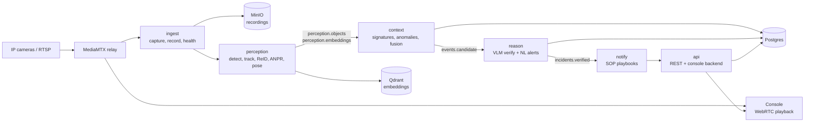

# Sentigon

Sentigon is a computer-vision intelligence layer that sits on top of ordinary IP cameras and
turns their video into structured, reasoned, and verified security events. Instead of leaving
an operator to watch a wall of feeds, the system detects objects and behaviours, groups them
into incidents, scores each one, asks a vision-language model to confirm or dismiss it, and
runs a response playbook — all as an event-driven pipeline of small services.

It is built as a local-first monorepo: the whole stack runs on a single workstation with one
GPU, and the heavier vision-language tier can be offloaded to a rented cloud GPU through a
config switch, without touching application code.

<p align="center">
  
  <br>
  <em>Live video wall — real YOLO detections and tracks drawn client-side from the event bus,
  tiles auto-ordered by current risk.</em>
</p>

## What it does

- **Live ingest and recording.** RTSP streams are captured, relayed through MediaMTX for
  browser playback (WebRTC/HLS), continuously recorded in segments to object storage, and
  kept in a short pre-roll ring buffer so evidence exists from *before* an incident fired.
- **Perception.** Per-camera workers run object detection, multi-object tracking (ByteTrack),
  pose, license-plate reading (ANPR), and appearance embeddings for cross-camera
  re-identification. Detections and embeddings are published to the bus, not baked into one
  process.
- **Behaviour signatures.** A stateful context engine consumes detections and evaluates
  behaviour rules — intrusion, loitering, tailgating, crowd formation, running, speeding,
  zone exclusion, and composite access-plus-video patterns such as a forced door with a person
  present, or an invalid badge followed by tailgating.
- **Anomaly detection.** Per-zone baselines are learned online; activity that deviates from a
  zone's normal profile is surfaced as an anomaly with its deviation score, so you are not
  limited to hand-written rules.
- **Risk scoring and triage.** Every candidate incident gets a composite risk score from
  severity, category, confidence, zone type, and correlated signals, then a P1–P4 priority
  band. Repeat detections of the same thing roll into one open incident instead of flooding
  the queue.
- **VLM verification.** High-value candidates are sent with pre/post-roll frames to a
  vision-language model that returns a verdict and a short rationale, which re-scores the
  incident. This is what separates a confirmed event from a noisy trigger.
- **Signal fusion.** Access-control events (badge reads, door-forced, door-held) are
  correlated with live video on a shared timeline and can elevate an otherwise ordinary video
  event into a real incident.
- **Response playbooks.** Confirmed incidents drive SOP actions: escalate, open a case, send
  email/webhook/web-push, run an autonomous timeline investigation, or play a spoken audio
  talk-down through a site speaker.
- **Forensics.** Any incident can be reconstructed into a multi-camera timeline that stitches
  together the subject's track, related incidents, and the recording segments that cover it.
- **Natural-language alerts.** Operators can define an alert in plain English ("a person on a
  bicycle at the loading dock after hours") and the VLM evaluates each frame against it on an
  interval.
- **Privacy controls.** Snapshots can be served with faces blurred, and plate values are
  stored salted-and-hashed rather than in the clear.

<p align="center">
  
  <br>
  <em>Threat queue ranked by composite risk, with the live log of automated SOP playbook runs
  beside it.</em>
</p>

## Architecture

The system is a set of small services that communicate over a Kafka-compatible event bus
(Redpanda). No service reaches into another's database; they publish and consume typed
messages on topics.



A shared library, `sentigon_common`, provides the ORM models, message schemas, bus helpers,
object storage, a tamper-evident evidence hash-chain, risk scoring, TTS, and structured
logging used by every service.

### Services

| Service | Responsibility |
|---|---|
| `common` | Shared schemas, ORM, Kafka/MinIO helpers, risk scoring, evidence vault, logging |
| `ingest` | RTSP capture, MediaMTX relay, segmented recording, pre-roll ring buffer, health |
| `perception` | Detection, tracking, ReID embeddings, ANPR, pose/fall detection |
| `context` | Behaviour signatures, learned anomaly baselines, access/video fusion, dedup |
| `reason` | VLM verification of candidate incidents, natural-language alert evaluation |
| `notify` | SOP response playbooks (escalate, case, email, webhook, web-push, talk-down) |
| `search` | Semantic, visual, and ReID forensic search over embeddings |
| `api` | REST API and backend for the console; threats, analytics, schedules, watchlists |
| `mediasource` | Registers sample video files as live RTSP cameras for development |
| `governance` | Model evaluation harness and champion-challenger promotion |
| `mcp` | Model Context Protocol surface for incident and search access |

## Models

All models run locally and are fetched separately (they are not committed to the repo).

| Task | Model |
|---|---|
| Object detection | Ultralytics YOLO (detect / segment) |
| Tracking | ByteTrack |
| Re-identification | OSNet-AIN (MSMT17) |
| License plates | YOLO plate detector + EasyOCR |
| Pose / fall | YOLO pose |
| Vision-language reasoning | Qwen2.5-VL (local, via Ollama) or Qwen3-VL (remote vLLM) |
| Text-to-speech | Piper |

The reasoning tier is pluggable through `REASON_ENDPOINT`, `REASON_MODEL`, and
`REASON_BACKEND`: the default runs a 7B VLM locally through Ollama, and the same service can
point at a larger model served by vLLM on a cloud GPU for batch verification.

<p align="center">
  
  <br>
  <em>Incident reconstruction — a subject's activity replayed across cameras with the covering
  recording segments and related incidents.</em>
</p>

## Development without camera hardware

You do not need physical cameras to run the system. Sample surveillance-style video files are
restreamed through MediaMTX as live RTSP feeds, and everything downstream of the RTSP ingress
is real: real frames, real inference, real tracks, real events. The sample clips used for
development are publicly available, appropriately licensed footage of public spaces.

## Getting started

**Prerequisites:** Docker + Docker Compose, [uv](https://docs.astral.sh/uv/) (which pins a
Python 3.11 virtualenv), and Node 20+ for the console. An NVIDIA GPU is recommended for
perception; the local VLM tier expects [Ollama](https://ollama.com).

```bash
# 1. Bring up infrastructure (Postgres, Redis, Redpanda, Qdrant, MinIO, MediaMTX)
make up

# 2. Apply the schema and seed the ontology, signatures, and sample cameras
make migrate
make seed

# 3. Publish the sample videos as RTSP cameras
make samples

# 4. Start the services (each blocks in the foreground; use separate terminals or systemd)
make ingest
make perception
make context
make reason
make notify
make api

# 5. Console
cd web && npm install && npm run dev
```

Then open the console in your browser and select the Video Wall. `make help` lists every
target, including `eval`, `bench`, `lint`, `typecheck`, `test`, and the `runpod-*` targets
that deploy, use, and tear down a cloud GPU for the larger VLM tier in one command.

Configuration lives in `.env` (copy your own from the documented keys). The committed defaults
are for local development only and must be changed before any real deployment.

## Repository layout

```
services/          the eleven microservices described above
web/               Next.js + React + Tailwind operator console
configs/           signature catalog, ontology seed, sample camera + playbook definitions
migrations/        Alembic schema migrations
models/            model weights (fetched, gitignored) and export scripts
bench/             evaluation and latency harnesses
scripts/           operational scripts (sample media, RunPod control, site-speaker stand-in)
infra/, deploy/    MediaMTX config, compose files, Helm chart
proto/             gRPC contracts
```

## Status and scope

This is an active engineering project, not a certified product. It runs end to end on a single
workstation and is intended for research, prototyping, and learning about event-driven
computer-vision systems. It ships with development-grade defaults (open ports, seeded
credentials, permissive settings) that are not suitable for production as-is. Treat any camera
footage and detection output according to the privacy laws that apply where you deploy it.

## Author

Built by **Sherin Joseph Roy**.

## License

Released under the [MIT License](LICENSE).
